---
title:  Analysis of an Boston housing dataset
date: 2023-11-03 20:20:10 +09:00
## Analysis of an Boston housing datasetDataset Part 4 (s2 2023)
46282858 Sangeun Lee


```python
import numpy as np 
import pandas as pd
import matplotlib.pyplot as plt
import seaborn as sns
```

### Explore the dataset


```python
ds = pd.read_csv("HousingData.csv")
ds.head()
```


<div>
<style scoped>
    .dataframe tbody tr th:only-of-type {
        vertical-align: middle;
    }

    .dataframe tbody tr th {
        vertical-align: top;
    }

    .dataframe thead th {
        text-align: right;
    }
</style>
<table border="1" class="dataframe">
  <thead>
    <tr style="text-align: right;">
      <th></th>
      <th>CRIM</th>
      <th>ZN</th>
      <th>INDUS</th>
      <th>CHAS</th>
      <th>NOX</th>
      <th>RM</th>
      <th>AGE</th>
      <th>DIS</th>
      <th>RAD</th>
      <th>TAX</th>
      <th>PTRATIO</th>
      <th>B</th>
      <th>LSTAT</th>
      <th>MEDV</th>
    </tr>
  </thead>
  <tbody>
    <tr>
      <th>0</th>
      <td>0.00632</td>
      <td>18.0</td>
      <td>2.31</td>
      <td>0.0</td>
      <td>0.538</td>
      <td>6.575</td>
      <td>65.2</td>
      <td>4.0900</td>
      <td>1</td>
      <td>296</td>
      <td>15.3</td>
      <td>396.90</td>
      <td>4.98</td>
      <td>24.0</td>
    </tr>
    <tr>
      <th>1</th>
      <td>0.02731</td>
      <td>0.0</td>
      <td>7.07</td>
      <td>0.0</td>
      <td>0.469</td>
      <td>6.421</td>
      <td>78.9</td>
      <td>4.9671</td>
      <td>2</td>
      <td>242</td>
      <td>17.8</td>
      <td>396.90</td>
      <td>9.14</td>
      <td>21.6</td>
    </tr>
    <tr>
      <th>2</th>
      <td>0.02729</td>
      <td>0.0</td>
      <td>7.07</td>
      <td>0.0</td>
      <td>0.469</td>
      <td>7.185</td>
      <td>61.1</td>
      <td>4.9671</td>
      <td>2</td>
      <td>242</td>
      <td>17.8</td>
      <td>392.83</td>
      <td>4.03</td>
      <td>34.7</td>
    </tr>
    <tr>
      <th>3</th>
      <td>0.03237</td>
      <td>0.0</td>
      <td>2.18</td>
      <td>0.0</td>
      <td>0.458</td>
      <td>6.998</td>
      <td>45.8</td>
      <td>6.0622</td>
      <td>3</td>
      <td>222</td>
      <td>18.7</td>
      <td>394.63</td>
      <td>2.94</td>
      <td>33.4</td>
    </tr>
    <tr>
      <th>4</th>
      <td>0.06905</td>
      <td>0.0</td>
      <td>2.18</td>
      <td>0.0</td>
      <td>0.458</td>
      <td>7.147</td>
      <td>54.2</td>
      <td>6.0622</td>
      <td>3</td>
      <td>222</td>
      <td>18.7</td>
      <td>396.90</td>
      <td>NaN</td>
      <td>36.2</td>
    </tr>
  </tbody>
</table>
</div>


```python
ds.shape
```


    (506, 14)


```python
ds.describe()
```


<div>
<style scoped>
    .dataframe tbody tr th:only-of-type {
        vertical-align: middle;
    }

    .dataframe tbody tr th {
        vertical-align: top;
    }

    .dataframe thead th {
        text-align: right;
    }
</style>
<table border="1" class="dataframe">
  <thead>
    <tr style="text-align: right;">
      <th></th>
      <th>CRIM</th>
      <th>ZN</th>
      <th>INDUS</th>
      <th>CHAS</th>
      <th>NOX</th>
      <th>RM</th>
      <th>AGE</th>
      <th>DIS</th>
      <th>RAD</th>
      <th>TAX</th>
      <th>PTRATIO</th>
      <th>B</th>
      <th>LSTAT</th>
      <th>MEDV</th>
    </tr>
  </thead>
  <tbody>
    <tr>
      <th>count</th>
      <td>486.000000</td>
      <td>486.000000</td>
      <td>486.000000</td>
      <td>486.000000</td>
      <td>506.000000</td>
      <td>506.000000</td>
      <td>486.000000</td>
      <td>506.000000</td>
      <td>506.000000</td>
      <td>506.000000</td>
      <td>506.000000</td>
      <td>506.000000</td>
      <td>486.000000</td>
      <td>506.000000</td>
    </tr>
    <tr>
      <th>mean</th>
      <td>3.611874</td>
      <td>11.211934</td>
      <td>11.083992</td>
      <td>0.069959</td>
      <td>0.554695</td>
      <td>6.284634</td>
      <td>68.518519</td>
      <td>3.795043</td>
      <td>9.549407</td>
      <td>408.237154</td>
      <td>18.455534</td>
      <td>356.674032</td>
      <td>12.715432</td>
      <td>22.532806</td>
    </tr>
    <tr>
      <th>std</th>
      <td>8.720192</td>
      <td>23.388876</td>
      <td>6.835896</td>
      <td>0.255340</td>
      <td>0.115878</td>
      <td>0.702617</td>
      <td>27.999513</td>
      <td>2.105710</td>
      <td>8.707259</td>
      <td>168.537116</td>
      <td>2.164946</td>
      <td>91.294864</td>
      <td>7.155871</td>
      <td>9.197104</td>
    </tr>
    <tr>
      <th>min</th>
      <td>0.006320</td>
      <td>0.000000</td>
      <td>0.460000</td>
      <td>0.000000</td>
      <td>0.385000</td>
      <td>3.561000</td>
      <td>2.900000</td>
      <td>1.129600</td>
      <td>1.000000</td>
      <td>187.000000</td>
      <td>12.600000</td>
      <td>0.320000</td>
      <td>1.730000</td>
      <td>5.000000</td>
    </tr>
    <tr>
      <th>25%</th>
      <td>0.081900</td>
      <td>0.000000</td>
      <td>5.190000</td>
      <td>0.000000</td>
      <td>0.449000</td>
      <td>5.885500</td>
      <td>45.175000</td>
      <td>2.100175</td>
      <td>4.000000</td>
      <td>279.000000</td>
      <td>17.400000</td>
      <td>375.377500</td>
      <td>7.125000</td>
      <td>17.025000</td>
    </tr>
    <tr>
      <th>50%</th>
      <td>0.253715</td>
      <td>0.000000</td>
      <td>9.690000</td>
      <td>0.000000</td>
      <td>0.538000</td>
      <td>6.208500</td>
      <td>76.800000</td>
      <td>3.207450</td>
      <td>5.000000</td>
      <td>330.000000</td>
      <td>19.050000</td>
      <td>391.440000</td>
      <td>11.430000</td>
      <td>21.200000</td>
    </tr>
    <tr>
      <th>75%</th>
      <td>3.560263</td>
      <td>12.500000</td>
      <td>18.100000</td>
      <td>0.000000</td>
      <td>0.624000</td>
      <td>6.623500</td>
      <td>93.975000</td>
      <td>5.188425</td>
      <td>24.000000</td>
      <td>666.000000</td>
      <td>20.200000</td>
      <td>396.225000</td>
      <td>16.955000</td>
      <td>25.000000</td>
    </tr>
    <tr>
      <th>max</th>
      <td>88.976200</td>
      <td>100.000000</td>
      <td>27.740000</td>
      <td>1.000000</td>
      <td>0.871000</td>
      <td>8.780000</td>
      <td>100.000000</td>
      <td>12.126500</td>
      <td>24.000000</td>
      <td>711.000000</td>
      <td>22.000000</td>
      <td>396.900000</td>
      <td>37.970000</td>
      <td>50.000000</td>
    </tr>
  </tbody>
</table>
</div>


```python
ds.isna().sum()
```


    CRIM       20
    ZN         20
    INDUS      20
    CHAS       20
    NOX         0
    RM          0
    AGE        20
    DIS         0
    RAD         0
    TAX         0
    PTRATIO     0
    B           0
    LSTAT      20
    MEDV        0
    dtype: int64


```python
ds.info()
```

    <class 'pandas.core.frame.DataFrame'>
    RangeIndex: 506 entries, 0 to 505
    Data columns (total 14 columns):
     #   Column   Non-Null Count  Dtype  
    ---  ------   --------------  -----  
     0   CRIM     486 non-null    float64
     1   ZN       486 non-null    float64
     2   INDUS    486 non-null    float64
     3   CHAS     486 non-null    float64
     4   NOX      506 non-null    float64
     5   RM       506 non-null    float64
     6   AGE      486 non-null    float64
     7   DIS      506 non-null    float64
     8   RAD      506 non-null    int64  
     9   TAX      506 non-null    int64  
     10  PTRATIO  506 non-null    float64
     11  B        506 non-null    float64
     12  LSTAT    486 non-null    float64
     13  MEDV     506 non-null    float64
    dtypes: float64(12), int64(2)
    memory usage: 55.5 KB


### Removing null values and fill with its mean values


```python
ds['CRIM'].fillna(ds['CRIM'].mean(), inplace=True)
ds['ZN'].fillna(ds['ZN'].mean(), inplace=True)
ds['INDUS'].fillna(ds['INDUS'].mean(), inplace=True)
ds['CHAS'].fillna(ds['CHAS'].mean(), inplace=True)
ds['AGE'].fillna(ds['AGE'].mean(), inplace=True)
ds['LSTAT'].fillna(ds['LSTAT'].mean(), inplace=True)
```


```python
ds.shape
```


    (506, 14)


+ Check the null values again


```python
ds.isna().sum()
```


    CRIM       0
    ZN         0
    INDUS      0
    CHAS       0
    NOX        0
    RM         0
    AGE        0
    DIS        0
    RAD        0
    TAX        0
    PTRATIO    0
    B          0
    LSTAT      0
    MEDV       0
    dtype: int64


### Explore the outliers


```python
fig, ax = plt.subplots(nrows=2, ncols=7, figsize=(20, 8))

for i, column in enumerate(ds.columns):
    index = ax[i // 7, i % 7]   
    index.boxplot(ds[column], notch=True, whis=2.5)
    index.set_xlabel(f"{column}")
plt.tight_layout()
plt.show()
```


    
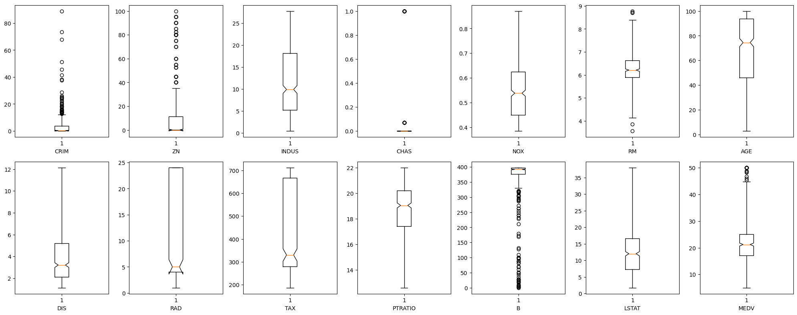
    


```python
fig, ax = plt.subplots(nrows=2, ncols=7, figsize=(20, 8))

for i, column in enumerate(ds.columns):
    index = ax[i // 7, i % 7]  
    index.hist(ds[column], bins=10)  
    index.set_xlabel(f"{column}")

plt.tight_layout()
plt.show()
```


    
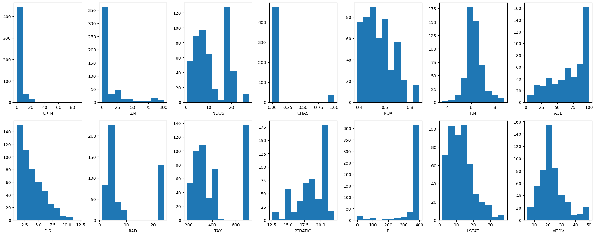
    


+ From the above graphs, these can be observed that there are many outliers in the boxplots. 
+ To follow normalization, histograms should simultaneously exhibit a bell-shaped curve, but some variables do not follow this pattern.
+ right skewed: CRIM, ZN, CHAS, DIS, RAD
+ Left skewed: AGE, B

### Kmeans clustering


```python
from sklearn.preprocessing import StandardScaler
from sklearn.decomposition import PCA
from sklearn.cluster import KMeans
```


```python
medv = ds['MEDV']
ds_cluster = ds.drop(['MEDV', 'RAD'], axis=1)
```

+ Remove the dependenct variable: MEDA
+ Remove Categorical Feature: RAD

+ Normalization


```python
scaler = StandardScaler()
scaler.fit(ds_cluster)
scaler_data = scaler.transform(ds_cluster)

pca = PCA(n_components = 2)
pca.fit(scaler_data)

ds2 = pd.DataFrame(data = pca.transform(scaler_data), columns=['pc1','pc2'])
ds2.head()
```


<div>
<style scoped>
    .dataframe tbody tr th:only-of-type {
        vertical-align: middle;
    }

    .dataframe tbody tr th {
        vertical-align: top;
    }

    .dataframe thead th {
        text-align: right;
    }
</style>
<table border="1" class="dataframe">
  <thead>
    <tr style="text-align: right;">
      <th></th>
      <th>pc1</th>
      <th>pc2</th>
    </tr>
  </thead>
  <tbody>
    <tr>
      <th>0</th>
      <td>-1.893931</td>
      <td>0.782165</td>
    </tr>
    <tr>
      <th>1</th>
      <td>-1.226157</td>
      <td>0.188585</td>
    </tr>
    <tr>
      <th>2</th>
      <td>-1.906287</td>
      <td>0.609065</td>
    </tr>
    <tr>
      <th>3</th>
      <td>-2.527127</td>
      <td>-0.007599</td>
    </tr>
    <tr>
      <th>4</th>
      <td>-2.014300</td>
      <td>-0.133133</td>
    </tr>
  </tbody>
</table>
</div>


```python
x = []   
y = []   
for k in range(1, 30):
    k_means = KMeans(n_clusters = k)
    k_means.fit(ds2)
    x.append(k)
    y.append(k_means.inertia_)
```

    /Users/leesangeun/anaconda3/lib/python3.11/site-packages/sklearn/cluster/_kmeans.py:870: FutureWarning: The default value of `n_init` will change from 10 to 'auto' in 1.4. Set the value of `n_init` explicitly to suppress the warning
      warnings.warn(
    /Users/leesangeun/anaconda3/lib/python3.11/site-packages/sklearn/cluster/_kmeans.py:870: FutureWarning: The default value of `n_init` will change from 10 to 'auto' in 1.4. Set the value of `n_init` explicitly to suppress the warning
      warnings.warn(
    /Users/leesangeun/anaconda3/lib/python3.11/site-packages/sklearn/cluster/_kmeans.py:870: FutureWarning: The default value of `n_init` will change from 10 to 'auto' in 1.4. Set the value of `n_init` explicitly to suppress the warning
      warnings.warn(
    /Users/leesangeun/anaconda3/lib/python3.11/site-packages/sklearn/cluster/_kmeans.py:870: FutureWarning: The default value of `n_init` will change from 10 to 'auto' in 1.4. Set the value of `n_init` explicitly to suppress the warning
      warnings.warn(
    /Users/leesangeun/anaconda3/lib/python3.11/site-packages/sklearn/cluster/_kmeans.py:870: FutureWarning: The default value of `n_init` will change from 10 to 'auto' in 1.4. Set the value of `n_init` explicitly to suppress the warning
      warnings.warn(
    /Users/leesangeun/anaconda3/lib/python3.11/site-packages/sklearn/cluster/_kmeans.py:870: FutureWarning: The default value of `n_init` will change from 10 to 'auto' in 1.4. Set the value of `n_init` explicitly to suppress the warning
      warnings.warn(
    /Users/leesangeun/anaconda3/lib/python3.11/site-packages/sklearn/cluster/_kmeans.py:870: FutureWarning: The default value of `n_init` will change from 10 to 'auto' in 1.4. Set the value of `n_init` explicitly to suppress the warning
      warnings.warn(
    /Users/leesangeun/anaconda3/lib/python3.11/site-packages/sklearn/cluster/_kmeans.py:870: FutureWarning: The default value of `n_init` will change from 10 to 'auto' in 1.4. Set the value of `n_init` explicitly to suppress the warning
      warnings.warn(
    /Users/leesangeun/anaconda3/lib/python3.11/site-packages/sklearn/cluster/_kmeans.py:870: FutureWarning: The default value of `n_init` will change from 10 to 'auto' in 1.4. Set the value of `n_init` explicitly to suppress the warning
      warnings.warn(
    /Users/leesangeun/anaconda3/lib/python3.11/site-packages/sklearn/cluster/_kmeans.py:870: FutureWarning: The default value of `n_init` will change from 10 to 'auto' in 1.4. Set the value of `n_init` explicitly to suppress the warning
      warnings.warn(
    /Users/leesangeun/anaconda3/lib/python3.11/site-packages/sklearn/cluster/_kmeans.py:870: FutureWarning: The default value of `n_init` will change from 10 to 'auto' in 1.4. Set the value of `n_init` explicitly to suppress the warning
      warnings.warn(
    /Users/leesangeun/anaconda3/lib/python3.11/site-packages/sklearn/cluster/_kmeans.py:870: FutureWarning: The default value of `n_init` will change from 10 to 'auto' in 1.4. Set the value of `n_init` explicitly to suppress the warning
      warnings.warn(
    /Users/leesangeun/anaconda3/lib/python3.11/site-packages/sklearn/cluster/_kmeans.py:870: FutureWarning: The default value of `n_init` will change from 10 to 'auto' in 1.4. Set the value of `n_init` explicitly to suppress the warning
      warnings.warn(
    /Users/leesangeun/anaconda3/lib/python3.11/site-packages/sklearn/cluster/_kmeans.py:870: FutureWarning: The default value of `n_init` will change from 10 to 'auto' in 1.4. Set the value of `n_init` explicitly to suppress the warning
      warnings.warn(
    /Users/leesangeun/anaconda3/lib/python3.11/site-packages/sklearn/cluster/_kmeans.py:870: FutureWarning: The default value of `n_init` will change from 10 to 'auto' in 1.4. Set the value of `n_init` explicitly to suppress the warning
      warnings.warn(
    /Users/leesangeun/anaconda3/lib/python3.11/site-packages/sklearn/cluster/_kmeans.py:870: FutureWarning: The default value of `n_init` will change from 10 to 'auto' in 1.4. Set the value of `n_init` explicitly to suppress the warning
      warnings.warn(
    /Users/leesangeun/anaconda3/lib/python3.11/site-packages/sklearn/cluster/_kmeans.py:870: FutureWarning: The default value of `n_init` will change from 10 to 'auto' in 1.4. Set the value of `n_init` explicitly to suppress the warning
      warnings.warn(
    /Users/leesangeun/anaconda3/lib/python3.11/site-packages/sklearn/cluster/_kmeans.py:870: FutureWarning: The default value of `n_init` will change from 10 to 'auto' in 1.4. Set the value of `n_init` explicitly to suppress the warning
      warnings.warn(
    /Users/leesangeun/anaconda3/lib/python3.11/site-packages/sklearn/cluster/_kmeans.py:870: FutureWarning: The default value of `n_init` will change from 10 to 'auto' in 1.4. Set the value of `n_init` explicitly to suppress the warning
      warnings.warn(
    /Users/leesangeun/anaconda3/lib/python3.11/site-packages/sklearn/cluster/_kmeans.py:870: FutureWarning: The default value of `n_init` will change from 10 to 'auto' in 1.4. Set the value of `n_init` explicitly to suppress the warning
      warnings.warn(
    /Users/leesangeun/anaconda3/lib/python3.11/site-packages/sklearn/cluster/_kmeans.py:870: FutureWarning: The default value of `n_init` will change from 10 to 'auto' in 1.4. Set the value of `n_init` explicitly to suppress the warning
      warnings.warn(
    /Users/leesangeun/anaconda3/lib/python3.11/site-packages/sklearn/cluster/_kmeans.py:870: FutureWarning: The default value of `n_init` will change from 10 to 'auto' in 1.4. Set the value of `n_init` explicitly to suppress the warning
      warnings.warn(
    /Users/leesangeun/anaconda3/lib/python3.11/site-packages/sklearn/cluster/_kmeans.py:870: FutureWarning: The default value of `n_init` will change from 10 to 'auto' in 1.4. Set the value of `n_init` explicitly to suppress the warning
      warnings.warn(
    /Users/leesangeun/anaconda3/lib/python3.11/site-packages/sklearn/cluster/_kmeans.py:870: FutureWarning: The default value of `n_init` will change from 10 to 'auto' in 1.4. Set the value of `n_init` explicitly to suppress the warning
      warnings.warn(
    /Users/leesangeun/anaconda3/lib/python3.11/site-packages/sklearn/cluster/_kmeans.py:870: FutureWarning: The default value of `n_init` will change from 10 to 'auto' in 1.4. Set the value of `n_init` explicitly to suppress the warning
      warnings.warn(
    /Users/leesangeun/anaconda3/lib/python3.11/site-packages/sklearn/cluster/_kmeans.py:870: FutureWarning: The default value of `n_init` will change from 10 to 'auto' in 1.4. Set the value of `n_init` explicitly to suppress the warning
      warnings.warn(
    /Users/leesangeun/anaconda3/lib/python3.11/site-packages/sklearn/cluster/_kmeans.py:870: FutureWarning: The default value of `n_init` will change from 10 to 'auto' in 1.4. Set the value of `n_init` explicitly to suppress the warning
      warnings.warn(
    /Users/leesangeun/anaconda3/lib/python3.11/site-packages/sklearn/cluster/_kmeans.py:870: FutureWarning: The default value of `n_init` will change from 10 to 'auto' in 1.4. Set the value of `n_init` explicitly to suppress the warning
      warnings.warn(
    /Users/leesangeun/anaconda3/lib/python3.11/site-packages/sklearn/cluster/_kmeans.py:870: FutureWarning: The default value of `n_init` will change from 10 to 'auto' in 1.4. Set the value of `n_init` explicitly to suppress the warning
      warnings.warn(


```python
plt.plot(x, y)
```


    [<matplotlib.lines.Line2D at 0x13e7ee410>]


    
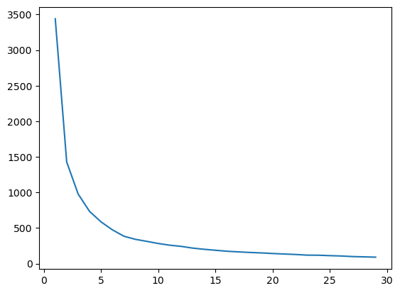
    


+ It seems nice when k is around 3 to 5.


```python
kmeans = KMeans(n_clusters=3)
kmeans.fit(ds2)

ds2['labels'] = kmeans.predict(ds2)
ds2.head()
```

    /Users/leesangeun/anaconda3/lib/python3.11/site-packages/sklearn/cluster/_kmeans.py:870: FutureWarning: The default value of `n_init` will change from 10 to 'auto' in 1.4. Set the value of `n_init` explicitly to suppress the warning
      warnings.warn(


<div>
<style scoped>
    .dataframe tbody tr th:only-of-type {
        vertical-align: middle;
    }

    .dataframe tbody tr th {
        vertical-align: top;
    }

    .dataframe thead th {
        text-align: right;
    }
</style>
<table border="1" class="dataframe">
  <thead>
    <tr style="text-align: right;">
      <th></th>
      <th>pc1</th>
      <th>pc2</th>
      <th>labels</th>
    </tr>
  </thead>
  <tbody>
    <tr>
      <th>0</th>
      <td>-1.893931</td>
      <td>0.782165</td>
      <td>1</td>
    </tr>
    <tr>
      <th>1</th>
      <td>-1.226157</td>
      <td>0.188585</td>
      <td>2</td>
    </tr>
    <tr>
      <th>2</th>
      <td>-1.906287</td>
      <td>0.609065</td>
      <td>1</td>
    </tr>
    <tr>
      <th>3</th>
      <td>-2.527127</td>
      <td>-0.007599</td>
      <td>1</td>
    </tr>
    <tr>
      <th>4</th>
      <td>-2.014300</td>
      <td>-0.133133</td>
      <td>1</td>
    </tr>
  </tbody>
</table>
</div>


+ The data 1 included cluster 3.
+ The data 3 included cluster 2.


```python
sns.scatterplot(x='pc1', y='pc2', hue='labels', data=ds2)
```


    <Axes: xlabel='pc1', ylabel='pc2'>


    
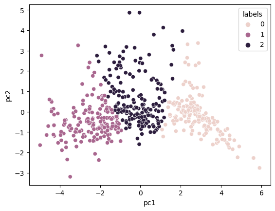
    


```python
ds2['MEDV'] = medv
medv_list = []

for i in range(3):
    medv_avg = ds2[ds2['labels']==i]['MEDV'].mean()
    medv_list.append(medv_avg)
sns.barplot(x=['group_0', 'group_1', 'group_2'], y=medv_list)
```


    <Axes: >


    
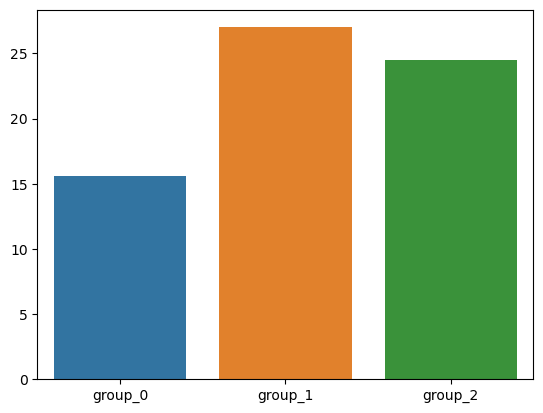
    


+ The group 1 has the value of smallest mean of the price.
+ The group 0 has the value of highest mean of the price.


```python
ds_cluster['labels'] = ds2['labels']
compare_real_data = ds_cluster[(ds_cluster['labels']==0) | (ds_cluster['labels']==1)|(ds_cluster['labels']==2)]
compare_real_data = compare_real_data.groupby('labels').mean().reset_index()

compare_real_data
```


<div>
<style scoped>
    .dataframe tbody tr th:only-of-type {
        vertical-align: middle;
    }

    .dataframe tbody tr th {
        vertical-align: top;
    }

    .dataframe thead th {
        text-align: right;
    }
</style>
<table border="1" class="dataframe">
  <thead>
    <tr style="text-align: right;">
      <th></th>
      <th>labels</th>
      <th>CRIM</th>
      <th>ZN</th>
      <th>INDUS</th>
      <th>CHAS</th>
      <th>NOX</th>
      <th>RM</th>
      <th>AGE</th>
      <th>DIS</th>
      <th>TAX</th>
      <th>PTRATIO</th>
      <th>B</th>
      <th>LSTAT</th>
    </tr>
  </thead>
  <tbody>
    <tr>
      <th>0</th>
      <td>0</td>
      <td>10.306690</td>
      <td>0.280298</td>
      <td>18.606987</td>
      <td>0.047685</td>
      <td>0.684081</td>
      <td>5.919025</td>
      <td>90.860810</td>
      <td>1.971126</td>
      <td>614.793750</td>
      <td>19.821875</td>
      <td>295.357375</td>
      <td>19.269579</td>
    </tr>
    <tr>
      <th>1</th>
      <td>1</td>
      <td>0.261209</td>
      <td>30.449751</td>
      <td>5.045111</td>
      <td>0.031285</td>
      <td>0.444027</td>
      <td>6.541632</td>
      <td>38.080550</td>
      <td>6.081955</td>
      <td>290.450292</td>
      <td>17.609357</td>
      <td>390.118830</td>
      <td>7.574640</td>
    </tr>
    <tr>
      <th>2</th>
      <td>2</td>
      <td>0.764978</td>
      <td>2.408477</td>
      <td>10.106674</td>
      <td>0.128113</td>
      <td>0.544537</td>
      <td>6.367783</td>
      <td>77.833524</td>
      <td>3.227984</td>
      <td>334.480000</td>
      <td>18.033143</td>
      <td>380.054629</td>
      <td>11.746358</td>
    </tr>
  </tbody>
</table>
</div>


```python
column = compare_real_data.columns
fig, ax = plt.subplots(2, 7, figsize=(30, 13))

for i in range(12):
    sns.barplot(x=column[i+1], y=column[i+1], data=compare_real_data, ax=ax[i//6, i%6])
    ax[i//6, i%6].set_xlabel(column[i+1])  
```


    
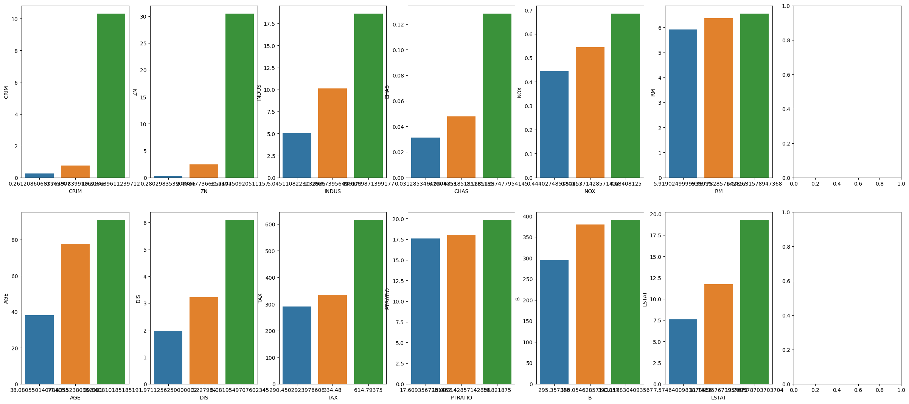
    


+ The group with the highest overall proportion: 2
+ Categories with no significantly difference between groups: RM("The number of room"), PTRATIO("The ratio of students and teachers").

### Nomalization
+ Variables with a significant difference between their minimum and maximum.
+ The values should be scaled to a range between 0 and 1.: "CRIM","ZN","TAX","B"


```python
from sklearn.preprocessing import MinMaxScaler

scaler = MinMaxScaler()
forscale = ["CRIM","ZN","TAX","B"]
ds[forscale] = scaler.fit_transform(ds[forscale])
```


```python
fig, ax = plt.subplots(nrows=1, ncols=len(forscale), figsize=(20, 8))

for i, column in enumerate(forscale):
    
    ax[i].hist(ds[column], bins=10)  
    ax[i].set_xlabel(column)

plt.tight_layout()
plt.show()
```


    
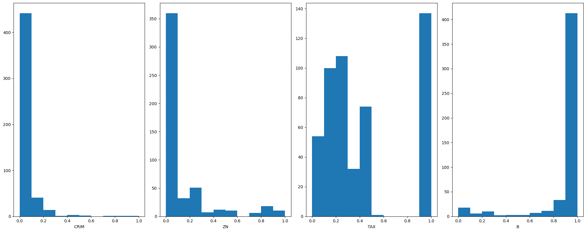
    


```python
ds.describe()
```


<div>
<style scoped>
    .dataframe tbody tr th:only-of-type {
        vertical-align: middle;
    }

    .dataframe tbody tr th {
        vertical-align: top;
    }

    .dataframe thead th {
        text-align: right;
    }
</style>
<table border="1" class="dataframe">
  <thead>
    <tr style="text-align: right;">
      <th></th>
      <th>CRIM</th>
      <th>ZN</th>
      <th>INDUS</th>
      <th>CHAS</th>
      <th>NOX</th>
      <th>RM</th>
      <th>AGE</th>
      <th>DIS</th>
      <th>RAD</th>
      <th>TAX</th>
      <th>PTRATIO</th>
      <th>B</th>
      <th>LSTAT</th>
      <th>MEDV</th>
    </tr>
  </thead>
  <tbody>
    <tr>
      <th>count</th>
      <td>506.000000</td>
      <td>506.000000</td>
      <td>506.000000</td>
      <td>506.000000</td>
      <td>506.000000</td>
      <td>506.000000</td>
      <td>506.000000</td>
      <td>506.000000</td>
      <td>506.000000</td>
      <td>506.000000</td>
      <td>506.000000</td>
      <td>506.000000</td>
      <td>506.000000</td>
      <td>506.000000</td>
    </tr>
    <tr>
      <th>mean</th>
      <td>0.040526</td>
      <td>0.112119</td>
      <td>11.083992</td>
      <td>0.069959</td>
      <td>0.554695</td>
      <td>6.284634</td>
      <td>68.518519</td>
      <td>3.795043</td>
      <td>9.549407</td>
      <td>0.422208</td>
      <td>18.455534</td>
      <td>0.898568</td>
      <td>12.715432</td>
      <td>22.532806</td>
    </tr>
    <tr>
      <th>std</th>
      <td>0.096052</td>
      <td>0.229211</td>
      <td>6.699165</td>
      <td>0.250233</td>
      <td>0.115878</td>
      <td>0.702617</td>
      <td>27.439466</td>
      <td>2.105710</td>
      <td>8.707259</td>
      <td>0.321636</td>
      <td>2.164946</td>
      <td>0.230205</td>
      <td>7.012739</td>
      <td>9.197104</td>
    </tr>
    <tr>
      <th>min</th>
      <td>0.000000</td>
      <td>0.000000</td>
      <td>0.460000</td>
      <td>0.000000</td>
      <td>0.385000</td>
      <td>3.561000</td>
      <td>2.900000</td>
      <td>1.129600</td>
      <td>1.000000</td>
      <td>0.000000</td>
      <td>12.600000</td>
      <td>0.000000</td>
      <td>1.730000</td>
      <td>5.000000</td>
    </tr>
    <tr>
      <th>25%</th>
      <td>0.000865</td>
      <td>0.000000</td>
      <td>5.190000</td>
      <td>0.000000</td>
      <td>0.449000</td>
      <td>5.885500</td>
      <td>45.925000</td>
      <td>2.100175</td>
      <td>4.000000</td>
      <td>0.175573</td>
      <td>17.400000</td>
      <td>0.945730</td>
      <td>7.230000</td>
      <td>17.025000</td>
    </tr>
    <tr>
      <th>50%</th>
      <td>0.003191</td>
      <td>0.000000</td>
      <td>9.900000</td>
      <td>0.000000</td>
      <td>0.538000</td>
      <td>6.208500</td>
      <td>74.450000</td>
      <td>3.207450</td>
      <td>5.000000</td>
      <td>0.272901</td>
      <td>19.050000</td>
      <td>0.986232</td>
      <td>11.995000</td>
      <td>21.200000</td>
    </tr>
    <tr>
      <th>75%</th>
      <td>0.040526</td>
      <td>0.112119</td>
      <td>18.100000</td>
      <td>0.000000</td>
      <td>0.624000</td>
      <td>6.623500</td>
      <td>93.575000</td>
      <td>5.188425</td>
      <td>24.000000</td>
      <td>0.914122</td>
      <td>20.200000</td>
      <td>0.998298</td>
      <td>16.570000</td>
      <td>25.000000</td>
    </tr>
    <tr>
      <th>max</th>
      <td>1.000000</td>
      <td>1.000000</td>
      <td>27.740000</td>
      <td>1.000000</td>
      <td>0.871000</td>
      <td>8.780000</td>
      <td>100.000000</td>
      <td>12.126500</td>
      <td>24.000000</td>
      <td>1.000000</td>
      <td>22.000000</td>
      <td>1.000000</td>
      <td>37.970000</td>
      <td>50.000000</td>
    </tr>
  </tbody>
</table>
</div>


+ These variables have been scaled to be within the range of 0 to 1.

### Correlation matrix


```python
correlation_matrix = ds.corr(numeric_only=True)
plt.figure(figsize=(30, 20))

mask = np.triu(np.ones_like(correlation_matrix, dtype=bool))
sns.heatmap(correlation_matrix, annot=True, cmap='RdYlBu_r', center=0, mask=mask)

plt.show()
```


    
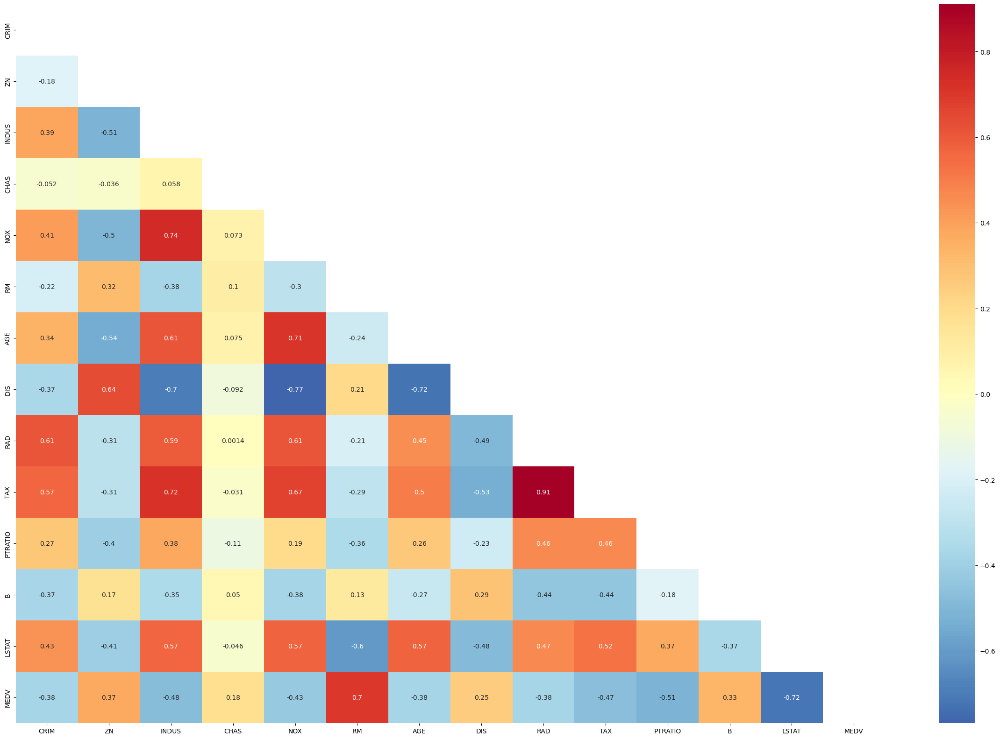
    


+ The highest value is RAD and TAX.( 0.91)
+ With MEDV, RM and LSTAT is highly correlated.
+ If MEDV decreases, LSTAT will increase about 72%.
+ If MEDV increases, RM will increase about 70%.
+ CHAS and MEDV has the smallest correlation.


```python
sns.regplot(x=ds["RM"], y=ds["MEDV"])
```


    <Axes: xlabel='RM', ylabel='MEDV'>


    
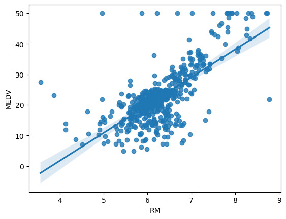
    


```python
sns.regplot(x=ds["RM"], y=ds["LSTAT"])
```


    <Axes: xlabel='RM', ylabel='LSTAT'>


    
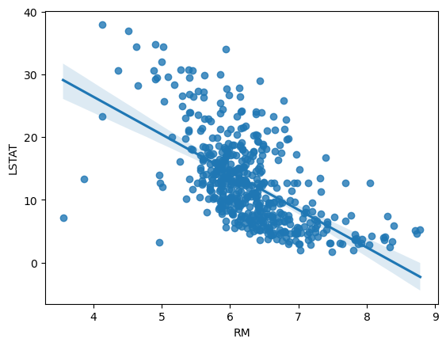
    


```python
sns.regplot(y=ds["RAD"], x=ds["TAX"])
```


    <Axes: xlabel='TAX', ylabel='RAD'>


    
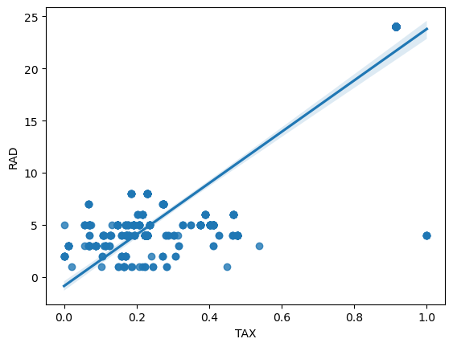
    


+ Remove the variables RAD and TAX from model, as they have a correlation of 0.91.
+ Remove the RM and PTRATIO, because the categories with no significantly difference between groups in K means clustering.
+ However, RM is highly correlated with dependance variable, so decided keep that into model.


```python
from sklearn.model_selection import train_test_split
from sklearn import linear_model
from sklearn.metrics import r2_score,mean_squared_error
from sklearn.feature_selection import RFE

reg = linear_model.LinearRegression()

train, test = train_test_split(ds, test_size=0.2, random_state=142)
print(f"train shape:" , train.shape)
print(f"train shape:" , test.shape)
```

    train shape: (404, 14)
    train shape: (102, 14)


```python
X_train = train.drop(['MEDV','RAD','TAX','PTRATIO'], axis=1)
y_train = train['MEDV']
X_test = test.drop(['MEDV','RAD','TAX','PTRATIO'], axis=1)
y_test = test['MEDV']
print("X_train shape: ", X_train.shape)
print("y_train shape: ", y_train.shape)
print("X_test shape: ", X_test.shape)
print("y_test shape: ", y_test.shape)
```

    X_train shape:  (404, 10)
    y_train shape:  (404,)
    X_test shape:  (102, 10)
    y_test shape:  (102,)


```python
X_train.head()
```


<div>
<style scoped>
    .dataframe tbody tr th:only-of-type {
        vertical-align: middle;
    }

    .dataframe tbody tr th {
        vertical-align: top;
    }

    .dataframe thead th {
        text-align: right;
    }
</style>
<table border="1" class="dataframe">
  <thead>
    <tr style="text-align: right;">
      <th></th>
      <th>CRIM</th>
      <th>ZN</th>
      <th>INDUS</th>
      <th>CHAS</th>
      <th>NOX</th>
      <th>RM</th>
      <th>AGE</th>
      <th>DIS</th>
      <th>B</th>
      <th>LSTAT</th>
    </tr>
  </thead>
  <tbody>
    <tr>
      <th>479</th>
      <td>0.161036</td>
      <td>0.0</td>
      <td>18.10</td>
      <td>0.069959</td>
      <td>0.614</td>
      <td>6.229</td>
      <td>88.0</td>
      <td>1.9512</td>
      <td>0.965757</td>
      <td>13.11</td>
    </tr>
    <tr>
      <th>323</th>
      <td>0.003120</td>
      <td>0.0</td>
      <td>7.38</td>
      <td>0.000000</td>
      <td>0.493</td>
      <td>5.708</td>
      <td>74.3</td>
      <td>4.7211</td>
      <td>0.985451</td>
      <td>11.74</td>
    </tr>
    <tr>
      <th>121</th>
      <td>0.000734</td>
      <td>0.0</td>
      <td>25.65</td>
      <td>0.000000</td>
      <td>0.581</td>
      <td>6.004</td>
      <td>84.1</td>
      <td>2.1974</td>
      <td>0.951510</td>
      <td>14.27</td>
    </tr>
    <tr>
      <th>77</th>
      <td>0.000908</td>
      <td>0.0</td>
      <td>12.83</td>
      <td>0.000000</td>
      <td>0.437</td>
      <td>6.140</td>
      <td>45.8</td>
      <td>4.0905</td>
      <td>0.974936</td>
      <td>10.27</td>
    </tr>
    <tr>
      <th>76</th>
      <td>0.001070</td>
      <td>0.0</td>
      <td>12.83</td>
      <td>0.000000</td>
      <td>0.437</td>
      <td>6.279</td>
      <td>74.5</td>
      <td>4.0522</td>
      <td>0.941399</td>
      <td>11.97</td>
    </tr>
  </tbody>
</table>
</div>


```python
y_train.head()
```


    479    21.4
    323    18.5
    121    20.3
    77     20.8
    76     20.0
    Name: MEDV, dtype: float64


```python
reg.fit(X_train, y_train)
hat = reg.predict(X_test)
mse = mean_squared_error(y_test, hat)
rmse =np.sqrt(mse)

result = pd.DataFrame({'MSE': [mse], 'RMSE': [rmse]}, index=['mymodel'])
print(result)
```

                   MSE      RMSE
    mymodel  21.932167  4.683179


```python
plt.scatter(y_test, hat, alpha=0.4)
plt.xlabel("Actual Price")
plt.ylabel("Predicted Price")
plt.title("LINEAR REGRESSION")
plt.show()
```


    
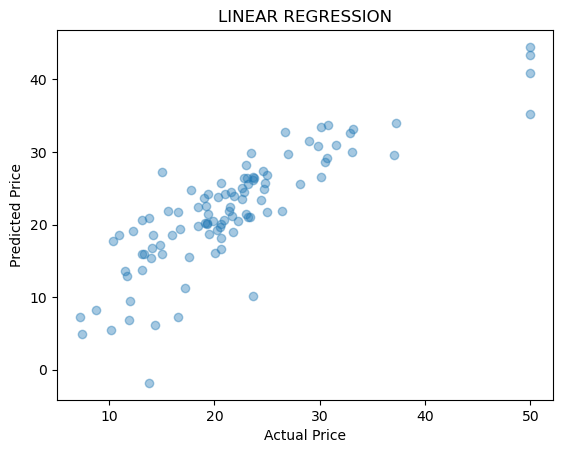
    


```python
reg.coef_
```


    array([-6.38120187,  6.78016208, -0.1149774 ,  3.10657159,  4.59309852,
           -0.01358575, -1.44507745,  0.15166777, -6.58979477,  3.48754551,
           -0.57063431])


+ When we visualize the correlation between predicted values and actual values, we observe a few outliers.
+ However overall, it appears a linear fit. 
+ Within the coefficient values, we find that the weight for NOX (-6.07541602,) is the highest(absolute value). This means that NOX has the most significant impact on Boston house prices. 


```python
from sklearn.feature_selection import RFE, RFECV
from sklearn.metrics import confusion_matrix, accuracy_score, classification_report
rfe = RFE(reg)
rfe = rfe.fit(X_train, y_train)
```


```python
X_train_rfe = X_train[X_train.columns[rfe.support_]]
reg.fit(X_train_rfe, y_train)

X_test_rfe = X_test[X_train.columns[rfe.support_]]
rfe_hat = reg.predict(X_test_rfe)
```


```python
print("MSE:  ", mean_squared_error(y_test, rfe_hat))
print("RMSE : ",np.sqrt(mean_squared_error(y_test, rfe_hat)))
```

    MSE:   25.42324966406389
    RMSE :  5.042147326691664


+ To perform a accurate analysis of how many variables to use, we use RFECV.


```python
rfecv = RFECV(estimator=reg, step=1, scoring='neg_mean_squared_error', cv=5)

rfecv.fit(X_train, y_train)
selected_variables = X_train.columns[rfecv.support_]

X_train_rfecv = X_train[selected_variables]
X_test_rfecv = X_test[selected_variables]

reg.fit(X_train_rfecv, y_train)
rfecv_hat = reg.predict(X_test_rfecv)
print("Selected variables:", rfecv.support_)
print("Selected variables:")
selected_variable_names = X_train.columns[rfecv.support_]
for variable in selected_variable_names:
    print(variable)
print("MSE:  ", mean_squared_error(y_test, rfecv_hat))
print("RMSE : ",np.sqrt(mean_squared_error(y_test, rfecv_hat)))

coeff = reg.coef_
plt.figure(figsize=(10, 6))
plt.bar(selected_variables, coeff)
plt.title('Model Coefficients')
plt.xlabel('Variable')
plt.ylabel('Coefficient Value')
plt.show()
```

    Selected variables: [ True  True  True  True  True  True False  True  True  True  True  True]
    Selected variables:
    CRIM
    ZN
    INDUS
    CHAS
    NOX
    RM
    DIS
    RAD
    TAX
    B
    LSTAT
    MSE:   21.248697096205053
    RMSE :  4.609630906721823


    
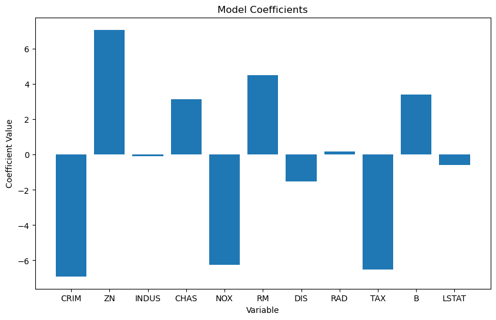
    


+ If the values of MSE and RMSE closer to 0, it means better model performance.
+ However, in the model both MSE and RMSE values are above 1. Therefore, we can't say the model perfectly performed.
+ Looking at the coefficient graph above, it generally shows that 'CRIM' and 'NOX' have the most significant impact. 
+ The model predicts that areas with higher carbon monoxide levels tend to have relatively lower house prices.
+ As the crime rate increases, house prices are expected to decrease.
+ A higher number of rooms is associated with higher house prices.
+ Furthermore, areas with a higher proportion of residential land exceeding 25,000 square feet tend to have higher house prices.


```python
from statsmodels.stats.outliers_influence import variance_inflation_factor

ds2 = ds.drop(['MEDV','PTRATIO','NOX','RM','TAX'], axis=1)
vif = pd.DataFrame()
vif["VIF Factor"] = [variance_inflation_factor(ds2.values, i) for i in range(ds2.shape[1])]
vif["features"] = ds2.columns
vif
```


<div>
<style scoped>
    .dataframe tbody tr th:only-of-type {
        vertical-align: middle;
    }

    .dataframe tbody tr th {
        vertical-align: top;
    }

    .dataframe thead th {
        text-align: right;
    }
</style>
<table border="1" class="dataframe">
  <thead>
    <tr style="text-align: right;">
      <th></th>
      <th>VIF Factor</th>
      <th>features</th>
    </tr>
  </thead>
  <tbody>
    <tr>
      <th>0</th>
      <td>2.017728</td>
      <td>CRIM</td>
    </tr>
    <tr>
      <th>1</th>
      <td>2.212124</td>
      <td>ZN</td>
    </tr>
    <tr>
      <th>2</th>
      <td>8.655297</td>
      <td>INDUS</td>
    </tr>
    <tr>
      <th>3</th>
      <td>1.111412</td>
      <td>CHAS</td>
    </tr>
    <tr>
      <th>4</th>
      <td>13.542931</td>
      <td>AGE</td>
    </tr>
    <tr>
      <th>5</th>
      <td>8.092018</td>
      <td>DIS</td>
    </tr>
    <tr>
      <th>6</th>
      <td>4.688840</td>
      <td>RAD</td>
    </tr>
    <tr>
      <th>7</th>
      <td>13.400421</td>
      <td>B</td>
    </tr>
    <tr>
      <th>8</th>
      <td>7.955740</td>
      <td>LSTAT</td>
    </tr>
  </tbody>
</table>
</div>


```python
reg.coef_
```


    array([-6.38120187,  6.78016208, -0.1149774 ,  3.10657159,  4.59309852,
           -0.01358575, -1.44507745,  0.15166777, -6.58979477,  3.48754551,
           -0.57063431])


```python
from sklearn.metrics import mean_squared_error

train_mse=mean_squared_error(y_train, y_train_pred) #훈련 데이터의 평가 점수
print("Train MSE:%.4f" % train_mse)

test_mse=mean_squared_error(y_test, hat)
print("Test MSE:%.4f" % test_mse)

train_rmse = np.sqrt(train_mse)
test_rmse = np.sqrt(test_mse)

print("Train RMSE:%.4f" % train_rmse)
print("Test RMSE:%.4f" % test_rmse)

```

    Train MSE:26.5519
    Test MSE:21.9322
    Train RMSE:5.1529
    Test RMSE:4.6832


---